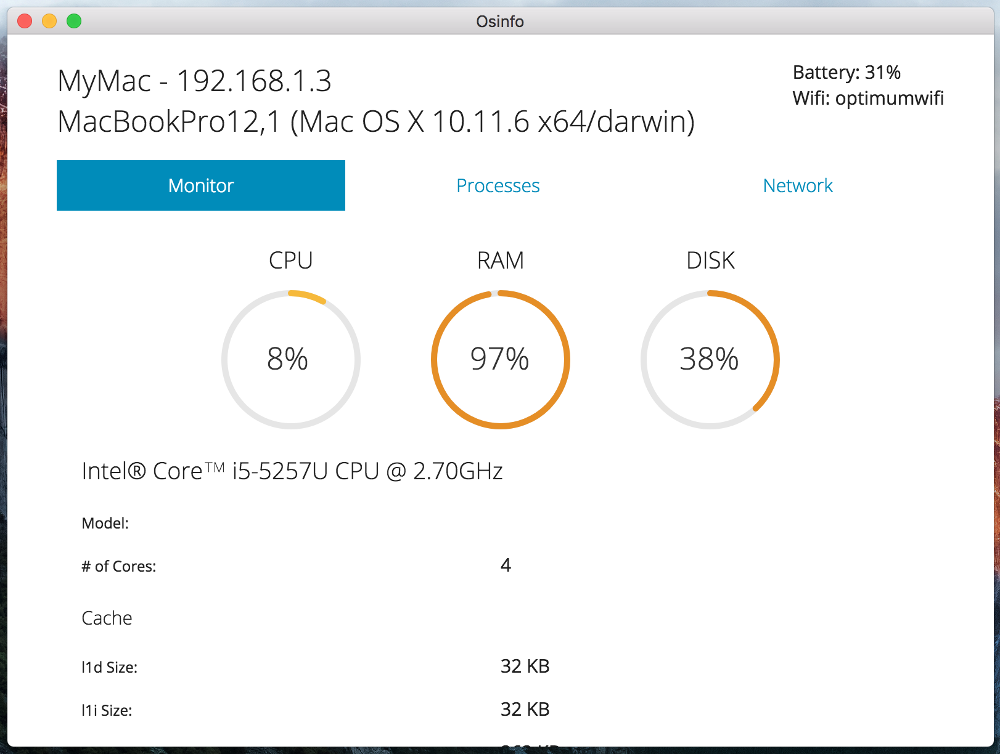

# Osinfo 

Osinfo is an experimental desktop app built with Electron and React.

# 

## Platforms

MacOS [Download for Mac](https://github.com/ajhenri/osinfo/blob/master/Osinfo.dmg?raw=true)

## Setup

```
$ git clone https://github.com/ajhenri/osinfo.git
$ cd osinfo
$ npm install
$ npm run start
```

## Todo

* Provide support for Windows and Linux.
* Include insight on Docker containers.
* Include more information on running tasks.

## License

MIT © [ajhenri](https://github.com/ajhenri)